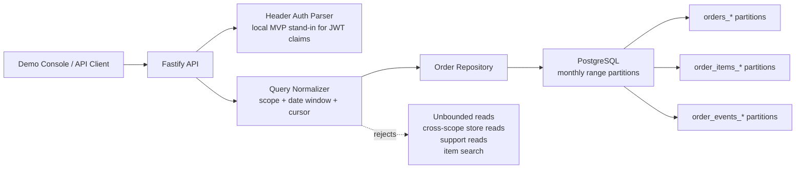
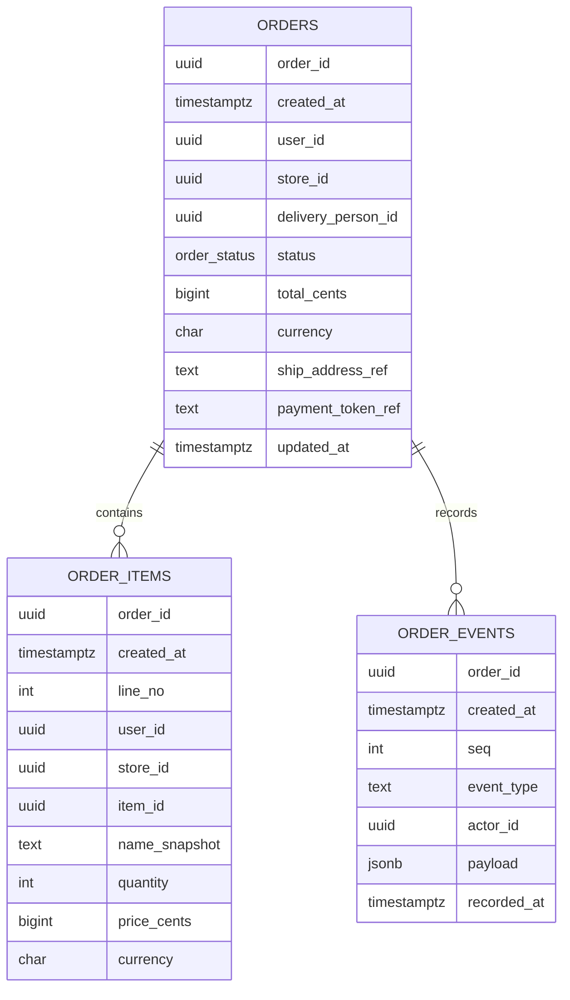
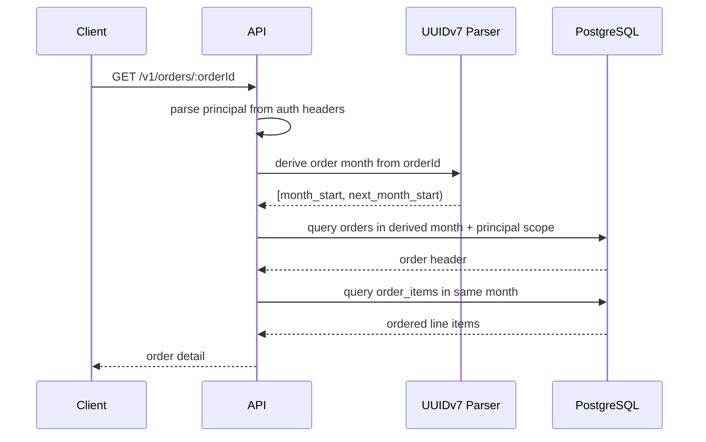
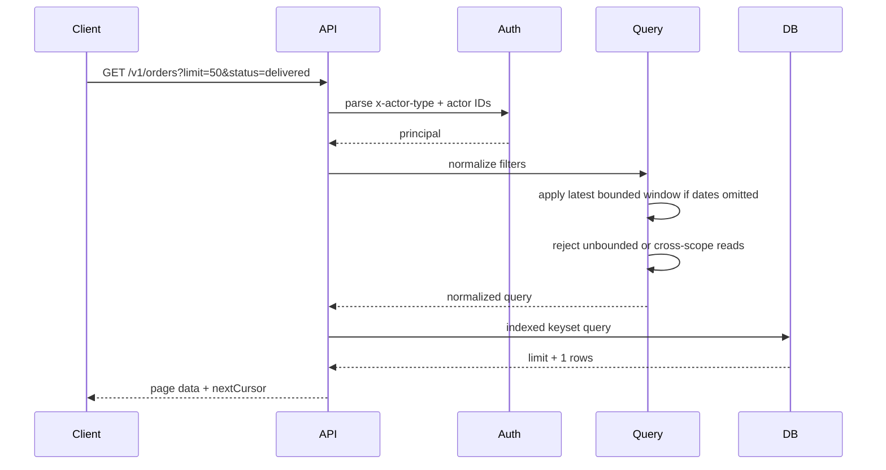
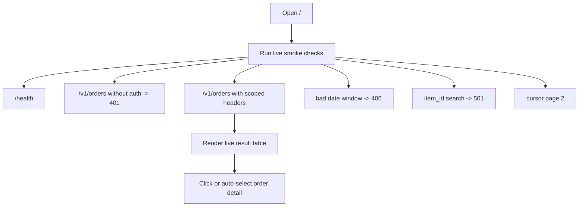

# Order History Lookup MVP

This repository is a runnable technical design for a high-volume food order history lookup service. It includes a Fastify API, a partitioned PostgreSQL schema, seed data, integration tests, and a browser demo console at `/`.

The design goal is not "make a table and search it." The goal is to make historical lookup feasible at large order volume by forcing every read through a narrow, permission-scoped, time-bounded, indexed access path.

Live demo:

```text
https://order-history-tech-spec.onrender.com/
```

## Executive Summary

The system supports two MVP readers:

- Customers looking up their own orders.
- Store staff looking up orders for stores in their authenticated scope.

The MVP intentionally defers courier-facing lookup, natural-language search, item search indexes, support/admin broad search, and cold archive serving. Those are called out as future phases so the first implementation can prove the exact lookup service before adding broader search surfaces.

The core design choices are:

- Monthly range partitions on `created_at`.
- UUIDv7 order IDs so direct order lookup can infer the likely month partition.
- Server-side principal scoping from auth claims, not request-supplied identity.
- Required date bounds or a bounded latest-page default.
- Keyset pagination on `(created_at, order_id)`.
- History indexes for customer and store paths.
- Tokenized address/payment references instead of raw PII or PAN.

## What The Demo Proves

The demo proves the query contract and API behavior:

- `/` serves an interviewer-friendly console.
- `/health` validates service availability.
- `/v1/orders` lists scoped order history.
- `/v1/orders/:orderId` returns order details and line items.
- Unauthenticated reads fail.
- Customer reads are restricted to the authenticated `user_id`.
- Store reads are restricted to authenticated `store_id` scope.
- One-sided or too-large date windows fail.
- Keyset pagination returns cursor-based pages.
- Deferred features return explicit errors instead of silently scanning.

The demo does not prove production throughput by itself. Render Free Postgres with seeded demo rows is for correctness and presentation. Large-volume claims require benchmark runs against large synthetic partitions and p95/p99 lookup timing.

## Architecture




Important boundary: the API owns authorization and query shaping. The browser can choose a demo actor, but the service still enforces principal scope before building SQL.

## Data Model




### `orders`

The order header table stores one row per order. It is optimized for history list and detail lookup, not analytics.

Key design points:

- Partitioned monthly by `created_at`.
- Primary key is `(created_at, order_id)` because partitioned PostgreSQL primary keys must include the partition key.
- `order_id` is UUIDv7; its embedded timestamp lets the detail endpoint derive the month window for partition pruning.
- `ship_address_ref` and `payment_token_ref` are references only. Raw addresses and payment data stay outside this service.

### `order_items`

Line items are stored because order detail screens need them. Item search is deliberately deferred; storing line items does not imply full-text or item-history search.

### `order_events`

Lifecycle and audit events are append-only. This preserves status history and future auditability without putting every event on the hot list path.

## Index Strategy

Required indexes:

```sql
CREATE INDEX idx_orders_user_history
  ON orders (user_id, created_at DESC, order_id DESC);

CREATE INDEX idx_orders_store_history
  ON orders (store_id, created_at DESC, order_id DESC);

CREATE INDEX idx_orders_store_active
  ON orders (store_id, status, created_at DESC, order_id DESC)
  WHERE status IN ('placed', 'confirmed', 'preparing', 'picked_up', 'out_for_delivery');

CREATE INDEX idx_order_items_detail
  ON order_items (created_at, order_id, line_no);

CREATE INDEX idx_order_events_detail
  ON order_events (created_at, order_id, seq);
```

Why this matters:

- Customer history uses `user_id + created_at DESC + order_id DESC`.
- Store history uses `store_id + created_at DESC + order_id DESC`.
- Active store views can use the partial active-status index.
- Detail item hydration uses `(created_at, order_id, line_no)`.
- Offset pagination is avoided because it gets slower as page depth grows.

## Query Contract

Every list query is scoped and time-bounded.


| Caller        | Required scope              | Optional filters                   | Pagination    |
| ------------- | --------------------------- | ---------------------------------- | ------------- |
| Customer      | `user_id` from auth headers | `store_id`, `status`, `from`, `to` | Keyset cursor |
| Store         | `store_id` in auth scope    | `user_id`, `status`, `from`, `to`  | Keyset cursor |
| Support/admin | Deferred                    | Deferred                           | Deferred      |
| Courier       | Deferred                    | Deferred                           | Deferred      |


Rules:

- Customers cannot pass `user_id`; it is taken from auth.
- Store callers must query a store inside `x-store-ids`.
- If `from` and `to` are omitted, the API uses `LATEST_LOOKBACK_DAYS`.
- If one date bound is provided without the other, the API rejects the query.
- If the date window exceeds `QUERY_WINDOW_MAX_DAYS`, the API rejects the query.
- Cursor pagination uses `(created_at, order_id) < (:cursor_created_at, :cursor_order_id)`.

List SQL shape:

```sql
SELECT order_id, created_at, user_id, store_id, delivery_person_id, status, total_cents, currency
FROM orders
WHERE created_at >= $1
  AND created_at < $2
  AND user_id = $3
ORDER BY created_at DESC, order_id DESC
LIMIT $4;
```

With a cursor:

```sql
AND (created_at, order_id) < ($cursor_created_at, $cursor_order_id)
```

The store path is the same shape with `store_id = $3`.

## Direct Order Lookup

Direct lookup uses the UUIDv7 timestamp to derive a month range.




This avoids asking the caller for a time hint and avoids scanning every partition for a single order ID.

## Runtime Workflow

### History List




### Demo Console




## Addressing The Review Pushback


| Concern                  | Response in this design                                                                                                                                                                                                                          | Status                                                                     |
| ------------------------ | ------------------------------------------------------------------------------------------------------------------------------------------------------------------------------------------------------------------------------------------------ | -------------------------------------------------------------------------- |
| Capacity math            | Baseline `10M orders/week` is about `16.5 orders/sec` average. The older `100M/week` stress scenario is about `165 orders/sec`. Write amplification is acknowledged because an order creates header, item, event, payment/refund/status records. | Documented here; production sizing still needs benchmark numbers.          |
| Active order count       | Active count is rate times active lifetime. At `10M/week` and 45 minutes, average active orders are roughly `45k` before peak multipliers.                                                                                                       | Documented; active-order partial index supports store active views.        |
| Delivery person lookup   | `delivery_person_id` exists in the schema to avoid a later data migration. Courier-facing query contract and index are deferred.                                                                                                                 | Explicitly deferred, not forgotten.                                        |
| Natural-language lookup  | NL parsing is not part of the storage design. It can become a UI/input layer that resolves to exact validated filters later.                                                                                                                     | Deferred.                                                                  |
| Direct `order_id` lookup | UUIDv7 encodes time, so the API derives the month partition from the ID and scopes the lookup by principal.                                                                                                                                      | Implemented.                                                               |
| Date bounds              | List reads require explicit `from`/`to` or the bounded latest-window default. Oversized windows are rejected.                                                                                                                                    | Implemented.                                                               |
| Store-name resolution    | The API accepts IDs only. Name search/disambiguation belongs in UI or a store directory service.                                                                                                                                                 | Deferred to UI layer.                                                      |
| Cache dependency         | Redis is not required for correctness. Indexed PostgreSQL is the source of truth. Cache is a later optimization for recent pages or dashboards.                                                                                                  | Correctness does not depend on cache.                                      |
| Order items              | `order_items` exists and is returned from detail lookup. Item search indexes are deferred.                                                                                                                                                       | Implemented for detail.                                                    |
| Security/privacy         | Principal scope is enforced server-side. Address/payment values are references. Support/admin requires audit logging before enablement.                                                                                                          | Partially implemented; production auth/JWT and audit logs are future work. |


## Scale And Lookup Timing

The service addresses `10M orders/week` by controlling lookup complexity, not by relying on a bigger machine.

Baseline math:

```text
10,000,000 orders/week / 7 / 24 / 60 / 60 = 16.5 orders/sec average
Active order estimate at 45 minutes = 16.5 * 2,700 = about 45,000 active orders average
```

The current query path does not ask PostgreSQL to search "all orders ever." A customer list lookup is constrained by:

```text
actor scope: user_id = authenticated customer
time scope: created_at inside explicit or default window
partition scope: created_at prunes monthly partitions
sort path: created_at DESC, order_id DESC
page depth: keyset cursor, no OFFSET
```

A store lookup is the same pattern with `store_id`.

What we can honestly claim today:

- The API enforces the query shape needed for large-volume lookup.
- The schema has the partitioning and indexes needed for the MVP access patterns.
- Integration tests prove scoping, time windows, pagination, partition-routed detail lookup, and IDOR protections.
- The Render demo proves correctness and user-facing behavior on seeded data.

What we should not claim yet:

- We have not benchmarked 10M rows.
- We have not proven p95/p99 DB execution time at production volume.
- Render Free Postgres is not a scale test environment.

Recommended benchmark plan:

1. Generate synthetic monthly partitions with at least 10M orders and realistic item/event amplification.
2. Skew data by high-volume stores and customers so indexes are tested under realistic hot keys.
3. Run `EXPLAIN (ANALYZE, BUFFERS)` for:
   - customer latest page
   - customer filtered by store and status
   - store latest page
   - store active-status page
   - direct order detail by UUIDv7
   - cursor page 2 and deeper pages
4. Record DB execution time and buffer reads.
5. Run concurrent read load and report p50, p95, p99, and error rate.
6. Compare the database timing from `Server-Timing: db;dur=<ms>` and response `meta.lookupMs` against browser round trip time.

## API Surface

### Health

```bash
curl https://order-history-tech-spec.onrender.com/health
```

Expected:

```json
{ "ok": true }
```

### Customer History

```bash
curl \
  -H 'x-actor-type: customer' \
  -H 'x-user-id: aaaaaaaa-aaaa-4aaa-8aaa-aaaaaaaaaaaa' \
  'https://order-history-tech-spec.onrender.com/v1/orders?store_id=11111111-1111-4111-8111-111111111111&limit=2'
```

### Store History

```bash
curl \
  -H 'x-actor-type: store' \
  -H 'x-store-ids: 11111111-1111-4111-8111-111111111111' \
  'https://order-history-tech-spec.onrender.com/v1/orders?limit=5'
```

### Detail Lookup

```bash
curl \
  -H 'x-actor-type: customer' \
  -H 'x-user-id: aaaaaaaa-aaaa-4aaa-8aaa-aaaaaaaaaaaa' \
  'https://order-history-tech-spec.onrender.com/v1/orders/<order_id>'
```

## Demo Walkthrough For Interviewers

1. Open `/`.
2. Start with `Ava Chen - May orders`; the timing strip shows status, row count, DB time, API time, RTT, cursor state, and partition window.
3. Use `Copy as curl` to prove the browser is making an ordinary API request.
4. Click `Explain plan` to show partition pruning and index evidence for the same scoped request.
5. Try `Nori Thai - Midtown` to show store-scoped cross-customer history.
6. Try `Cross-store denied`, `Window too wide`, and `Item search deferred` to show the guardrails.
7. Try `Pagination - page 2` to show keyset cursor behavior without `OFFSET`.
8. Click a row or `Direct order lookup` to show UUIDv7 month-routed detail lookup and line-item hydration.
9. Use the scale panel to explain that the seeded DB proves the access contract, while production p95/p99 proof requires the benchmark plan above.

## Local Setup

```bash
npm ci
docker compose up -d
npm run migrate
npm run seed
npm run dev
```

Open:

```text
http://localhost:3000
```

## Validation

Unit tests:

```bash
npm test
```

TypeScript build:

```bash
npm run build
```

Integration tests against real local PostgreSQL:

```bash
docker compose up -d
npm run migrate
npm run test:integration
```

The integration suite covers:

- customer scoping
- store scoping
- time-window filtering
- keyset pagination
- direct lookup through UUIDv7-derived month window
- item hydration
- IDOR protection

## Render Deployment

Use Render Node runtime settings:

```text
Build Command: npm ci && npm run build
Start Command: npm start
Health Check Path: /health
```

Environment variables:

```text
DATABASE_URL=<Render internal Postgres URL>
NODE_VERSION=22.21.1
PGPOOL_MAX=10
QUERY_WINDOW_MAX_DAYS=93
LATEST_LOOKBACK_DAYS=90
```

Migrate or seed Render Postgres from a local machine using the external database URL with TLS:

```bash
DATABASE_URL='<external-url>?sslmode=require' npm run migrate
DATABASE_URL='<external-url>?sslmode=require' npm run seed
```

## Production Hardening

Before calling this production-ready:

- Replace demo headers with verified JWT/session claims.
- Add audit logging for any support/admin read path.
- Add courier query contract and `delivery_person_id` index if courier lookup becomes in scope.
- Add load tests and 10M-row benchmark evidence.
- Add migration automation and partition creation runbooks.
- Add retention/anonymization jobs for PII reference deletion.
- Add observability dashboards for p95/p99 lookup latency, DB pool pressure, slow queries, and error rate.
- Rotate database credentials that were exposed during setup.

## Repository Structure

- `MVP_TECH_SPEC.md`: original MVP storage and query contract.
- `docs/review-pushback.md`: design critique that shaped the final access patterns.
- `migrations/001_init_order_history.sql`: partitioned schema, indexes, and partition creation function.
- `src/server.ts`: Fastify app, error handling, health route, demo route, and order route registration.
- `src/orders/queries.ts`: query normalization, auth-scope enforcement, date guards, and SQL builders.
- `src/orders/repository.ts`: list/detail repository methods and cursor generation.
- `src/orders/ingest.ts`: minimal insert helper used by seed and integration tests.
- `src/demo.ts`: self-contained browser demo console.
- `scripts/migrate.ts`: idempotent migration runner.
- `scripts/seed.ts`: deterministic demo data.
- `tests/`: unit and real-Postgres integration tests.
